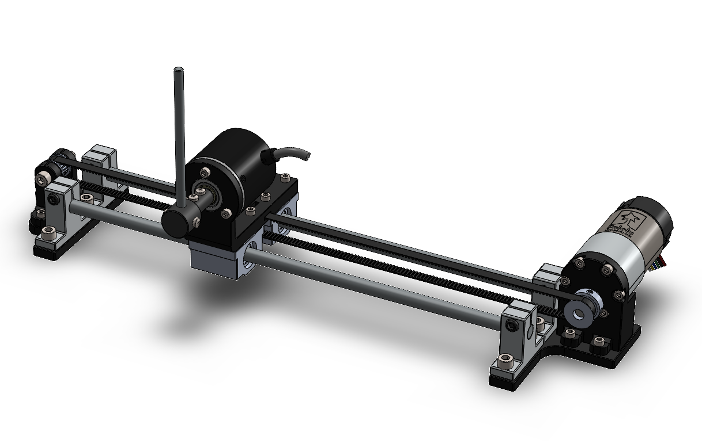
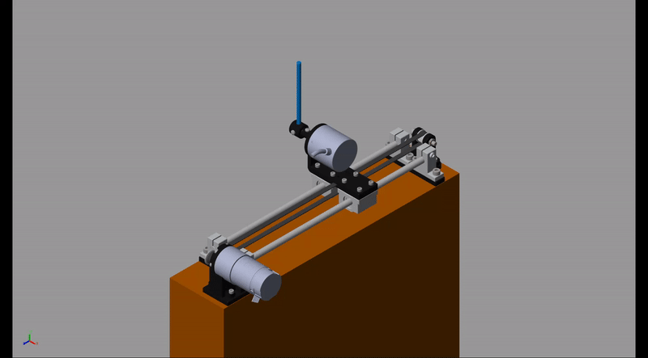

<a href="https://www.youtube.com/c/Amplicationcom">
    
</a>

<div align="center"><h1 align="center">SELF BALANCING INVERTED PENDULUM</h1></div>


<i>This project involves designing and modelling of a Self balancing Inverted pendulum on cart using MATLAB/Simulink, Using a popular library called "SIMSCAPE". Inverted Pendulum is a system very known and used in Academia to teach Control Theory to have fundamental knowlegde. As the nature of an inverted pendulum is nonlinear unstable system, many problems arises in order to control and stabilize it. This can be due to constraints including friction, cart rail limitation, saturated control signals. Problems then involved in most literature for an inverted pendulum system is swing up and stabilization</i>

---



---

# Contents

* [Project Details](#Project-details)
* [How to run the session](#How-to-run-the-session)
* [Demo](#Demo)
* [Reference](#Reference)

# Project details

This project demonstrate the design and an simulation of an inverted pendulum on cart whch can balance itself due to external disturbance. The approach used here is by using the blocks of [simscape](https://www.mathworks.com/products/simscape.html) library in [MATLAB/Simulink](https://www.mathworks.com/products/simulink.html), which consist of actual components representing the real world.

## Equation of motion
The dynamic equation of motion of the Inverted pendulum including motor dynamics is calculated as;

$$
\left(M + m + \frac{J_m}{r^2}\right)\ddot{x}(t) + \left(b + \frac{b_m}{r^2} + \frac{K_bK_t}{r^2R}\right)\dot{x}(t) + ml\ddot{\theta}\\ = \left(\frac{K_t}{r^2R}\right)V_m(t)
$$

$$(I + ml^2)\ddot{\theta} + ml\ddot{x} - mgl\theta = 0$$


# Report
A report of this project is well explained written in the IEEE conference format, consult it for more litterature explanation

# How to run the session

Current update folder
```
For Matlab V3
```
* Downlaod the zip file containing all the files from Github
* Open the matlab live script (IP.mlx) and run all the sections
* Open the Simulink file IP.slx, set the ref positionon the cart
* Run the simulation, the mechanics explorer  will automatically appear 

# Demo



# Reference
- Singla, A. & Singh, G. (2017). Real-Time Swing-up and Stabilization Control of a Cart-Pendulum System with Constrained Cart Movement
. International Journal of Nonlinear Sciences and Numerical Simulation, 18(6), 525-539. https://doi.org/10.1515/ijnsns-2017-0040

- E. Susanto, A. Surya Wibowo and E. Ghiffary Rachman, "Fuzzy Swing Up Control and Optimal State Feedback Stabilization for Self-Erecting Inverted Pendulum," in IEEE Access, vol. 8, pp. 6496-6504, 2020, doi: 10.1109/ACCESS.2019.2963399.

- https://ctms.engin.umich.edu/CTMS/index.php?example=InvertedPendulum&section=SystemModeling
